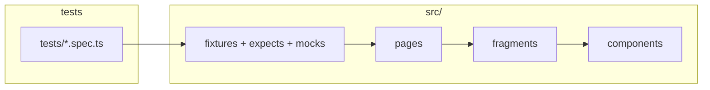

# demo-trend-automation

## Архитектура



| Слой       | Папка                |
| ---------- | -------------------- |
| Сценарии   | `tests/`             |
| Страницы   | `src/ui/pages/`      |
| Фрагменты  | `src/ui/fragments/`  |
| Компоненты | `src/ui/components/` |

### Назначение слоёв

**Страницы (`src/ui/pages/`)** — Page Object для маршрута или экрана. Наследуют `BasePage`: навигация (`openPage`, `reload`, `waitForUrl`), метаданные страницы, скриншоты; шаги обёрнуты в Allure. В конструкторе только подключают нужные фрагменты. Сценарные методы уровня страницы (несколько фрагментов, смена URL) живут здесь.

**Фрагменты (`src/ui/fragments/`)** — переиспользуемые блоки UI (хедер, форма, футор). У каждого фрагмента есть **`root`** (`Locator`) — граница блока. Все элементы блока ищутся **внутри `root`** (или внутри `component.element` для вложенности). Статичные контролы объявляются в конструкторе; элементы с параметром или появляющиеся после действия — через **методы** фрагмента, возвращающие компоненты.

**Компоненты (`src/ui/components/`)** — атомарные элементы (`Button`, `Input`, `Checkbox`, `Label`, `Select`, `Title`). Наследуют `BaseComponent`: локатор относительно страницы или родителя, имя для отчёта, действия (`click`, `fill`, …) с шагами Allure.

### Инфраструктура тестов

| Область | Папка / файл | Роль |
| ------- | ------------ | ---- |
| Фикстуры | `src/fixtures/` | `pomTest`: страницы (`mainPage`, `demoPage`, `ssoLoginPage`) и `apiMock`; `merge.fixtures` объединяет раннер с POM и расширенным `expect`. |
| Проверки | `src/expects/` | Матчеры с суффиксом `Allure` для отчёта. |
| Моки | `src/mocks/` | `ApiMock` — подмена ответов до навигации, без переноса логики в POM. |
| Точка входа | `index.ts` | Экспорт `test`, `expect`, страниц, фрагментов, компонентов, типов моков. |

Тесты импортируют **`test` и `expect` только из `index.ts`**, получают готовые страницы из фикстур и ходят в UI через цепочку **страница → фрагмент → компонент**.

### Принципы

- Один стабильный локатор — одно место (компонент или фрагмент).
- Скоуп: элементы фрагмента не ищутся «с корня страницы», если уже есть `root`.
- Моки и маршрутизация сети — на стороне фикстур/тестов, не внутри Page Object.

## Запуск

```bash
npm ci && npx playwright install
npx playwright test
```
