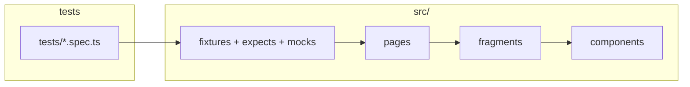

# demo-trend-automation

## Архитектура



| Слой       | Папка                |
| ---------- | -------------------- |
| Сценарии   | `tests/`             |
| Страницы   | `src/ui/pages/`      |
| Фрагменты  | `src/ui/fragments/`  |
| Компоненты | `src/ui/components/` |

## Запуск

```bash
npm ci && npx playwright install
npx playwright test
```
